# 🏗️ RuboCop HK Architecture

> **Comprehensive architecture documentation for RuboCop HK configuration gem**

## 📋 Table of Contents

- [🎯 Overview](#-overview)
- [🏛️ System Architecture](#️-system-architecture)
- [📦 Module Structure](#-module-structure)
- [⚙️ Configuration System](#️-configuration-system)
- [🔄 Plugin Integration](#-plugin-integration)
- [🧪 Testing Architecture](#-testing-architecture)
- [🚀 Deployment Flow](#-deployment-flow)
- [🔧 Extension Points](#-extension-points)
- [📊 Performance Considerations](#-performance-considerations)

## 🎯 Overview

RuboCop HK is a comprehensive configuration gem that provides curated RuboCop rules for modern Ruby and Rails applications. It follows a modular architecture that allows for flexible configuration inheritance and extensibility.

### Design Principles

- **🔧 Modular Configuration** - Separate configs for different concerns
- **📈 Gradual Adoption** - Easy migration path for existing projects
- **🎯 Rails-First** - Optimized for Rails development patterns
- **🔌 Extensible** - Plugin architecture for custom cops
- **⚡ Performance** - Minimal overhead and fast execution

## 🏛️ System Architecture

### High-Level Architecture

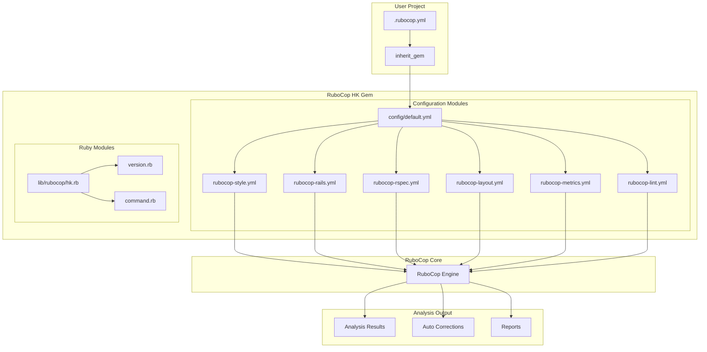

### Component Interaction Flow

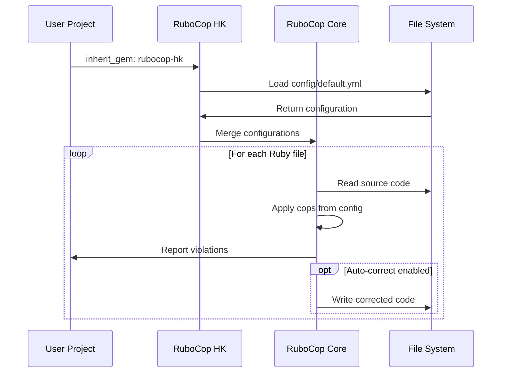

## 📦 Module Structure

### Directory Layout

```
lib/
├── rubocop/
│   └── hk/
│       ├── version.rb          # Gem version
│       ├── command.rb          # CLI commands
│       └── cops/              # Custom cops (future)
│           └── custom/
│               └── business_logic.rb
├── rubocop/
│   └── hk.rb                  # Main module
config/
├── default.yml               # Main configuration
├── rubocop-style.yml         # Style rules
├── rubocop-rails.yml         # Rails-specific rules
├── rubocop-rspec.yml         # RSpec rules
├── rubocop-layout.yml        # Code layout rules
├── rubocop-metrics.yml       # Complexity metrics
└── rubocop-lint.yml          # Lint rules
```

### Module Dependencies

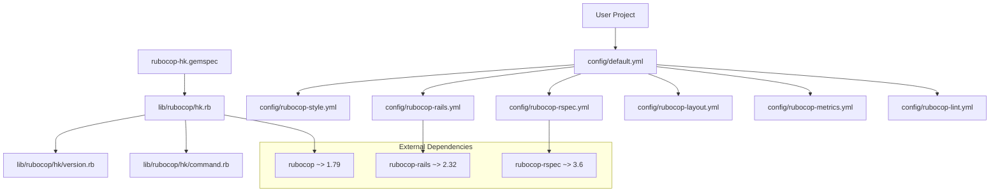

## ⚙️ Configuration System

### Configuration Inheritance

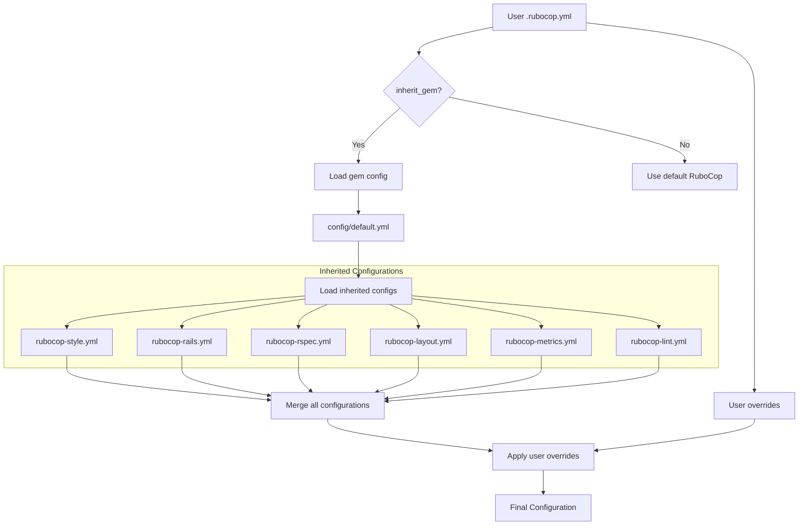

### Configuration Priority

1. **User .rubocop.yml** (Highest Priority)
2. **Gem default.yml** 
3. **Individual module configs**
4. **RuboCop defaults** (Lowest Priority)

### Dynamic Configuration

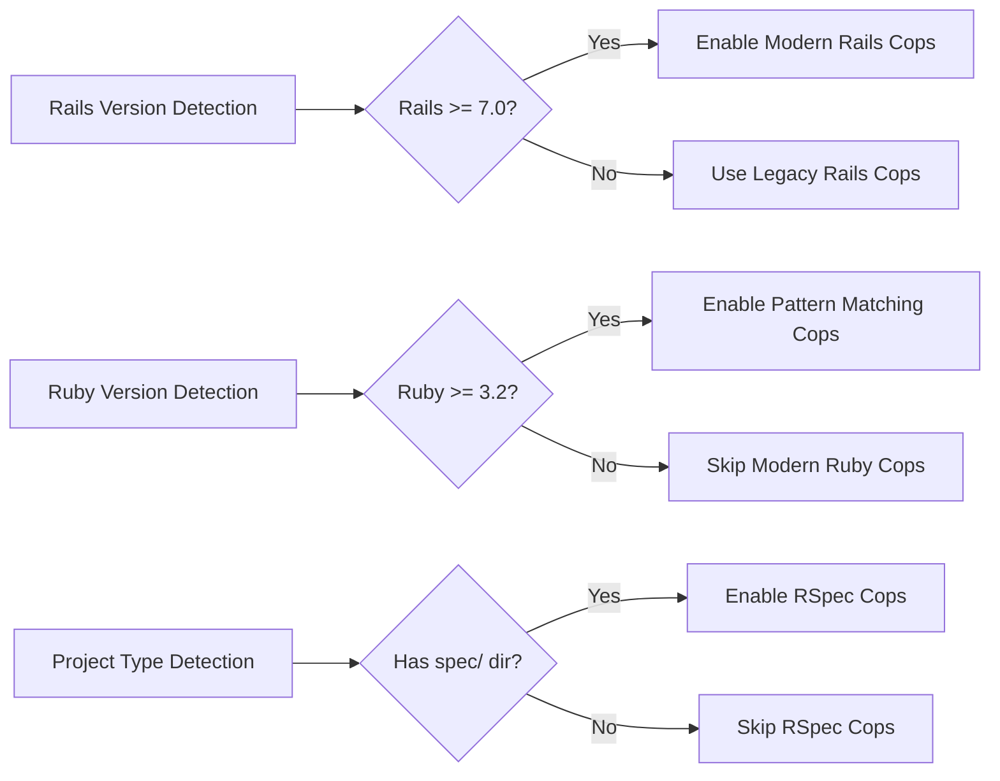

## 🔄 Plugin Integration

### RuboCop Plugin System

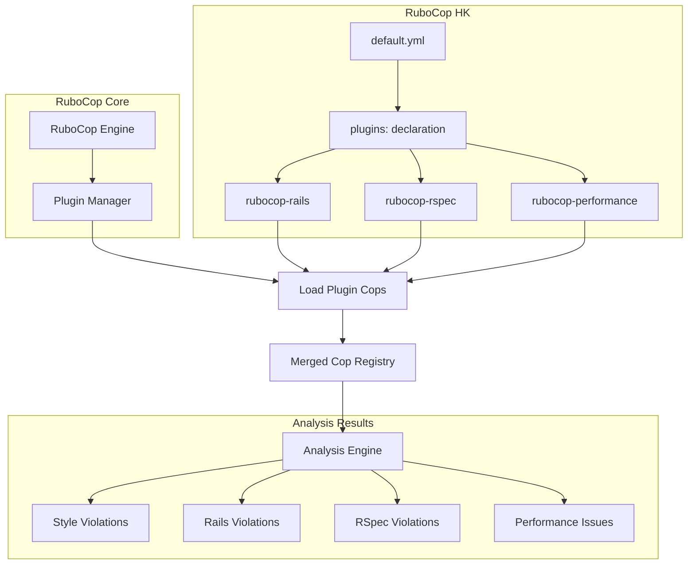

### Custom Cops Architecture

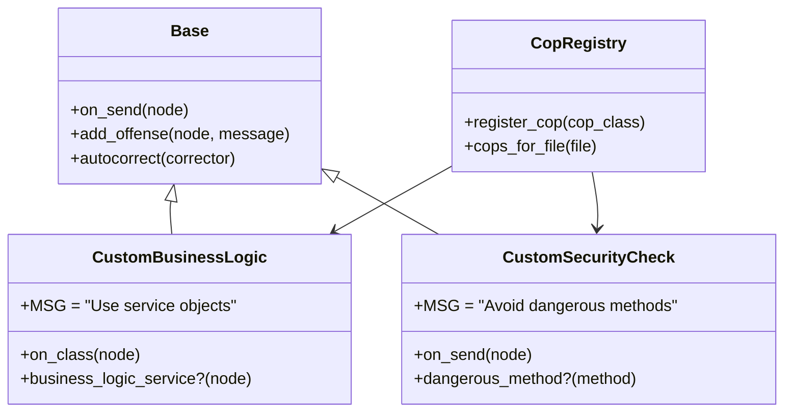

## 🧪 Testing Architecture

### Test Suite Structure

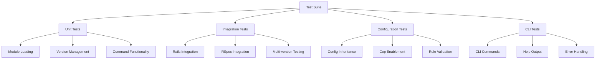

### Test Execution Flow

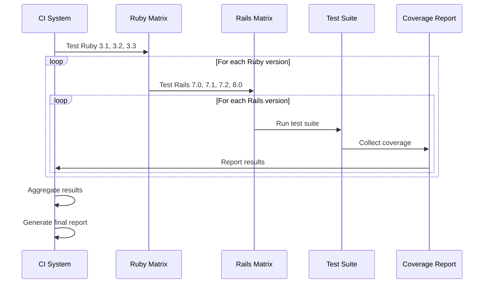

## 🚀 Deployment Flow

### Release Process

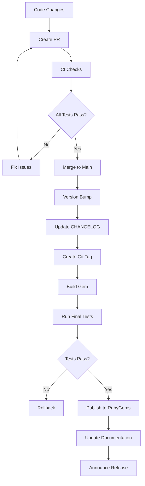

### Continuous Integration

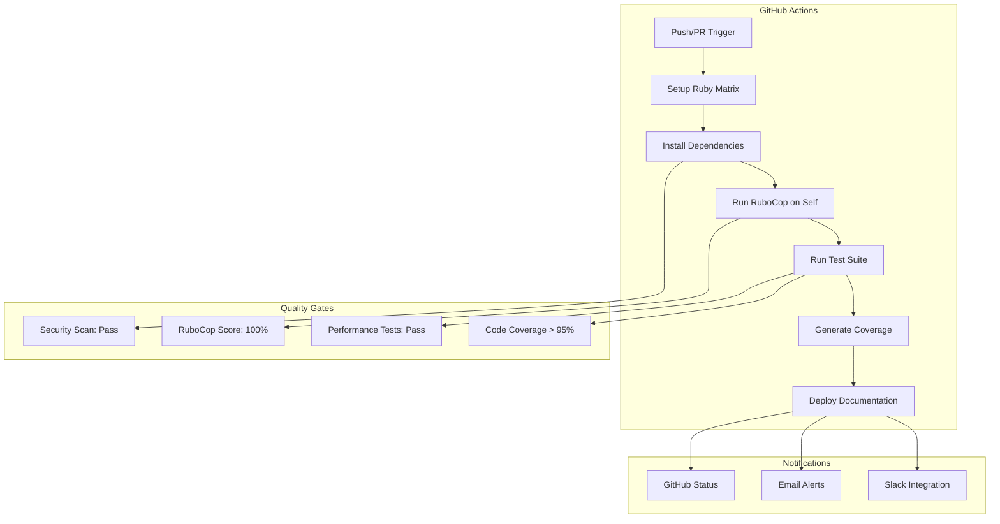

## 🔧 Extension Points

### Custom Cop Development

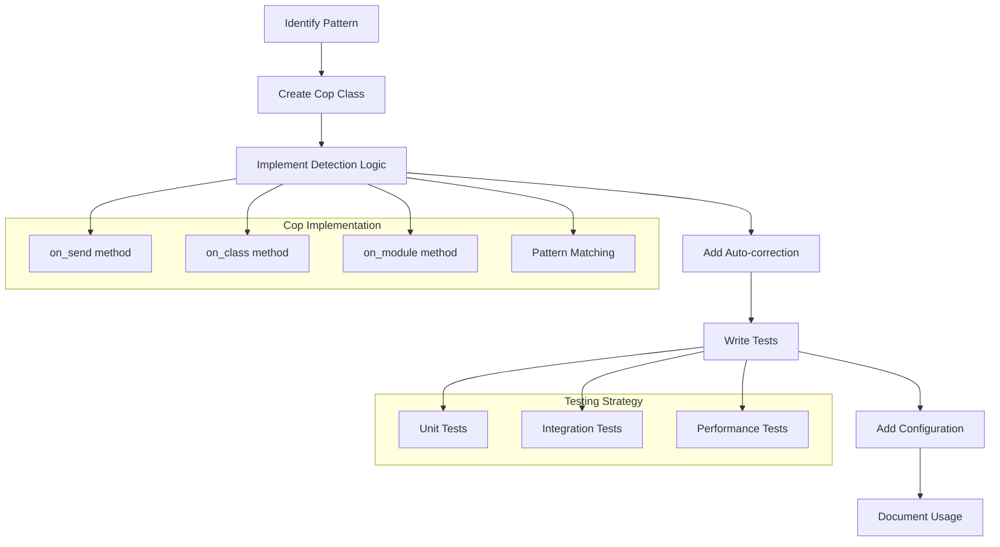

### Configuration Extension

```yaml
# Example custom configuration
inherit_gem:
  rubocop-hk: config/default.yml

# Custom cops namespace
CustomCops:
  BusinessLogic:
    Enabled: true
    Severity: warning
  
  SecurityCheck:
    Enabled: true
    Severity: error
    Exclude:
      - "lib/legacy/**/*"
```

## 📊 Performance Considerations

### Analysis Performance

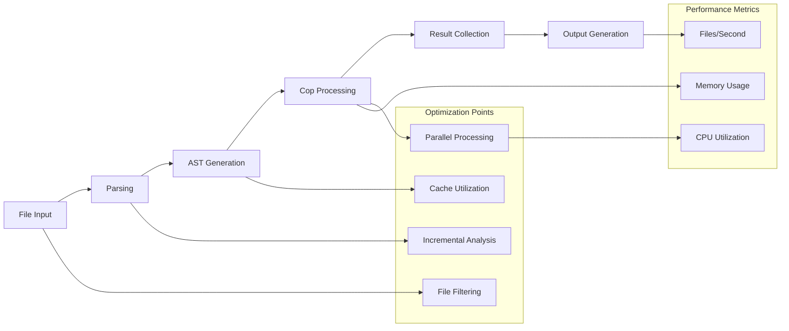

### Memory Management

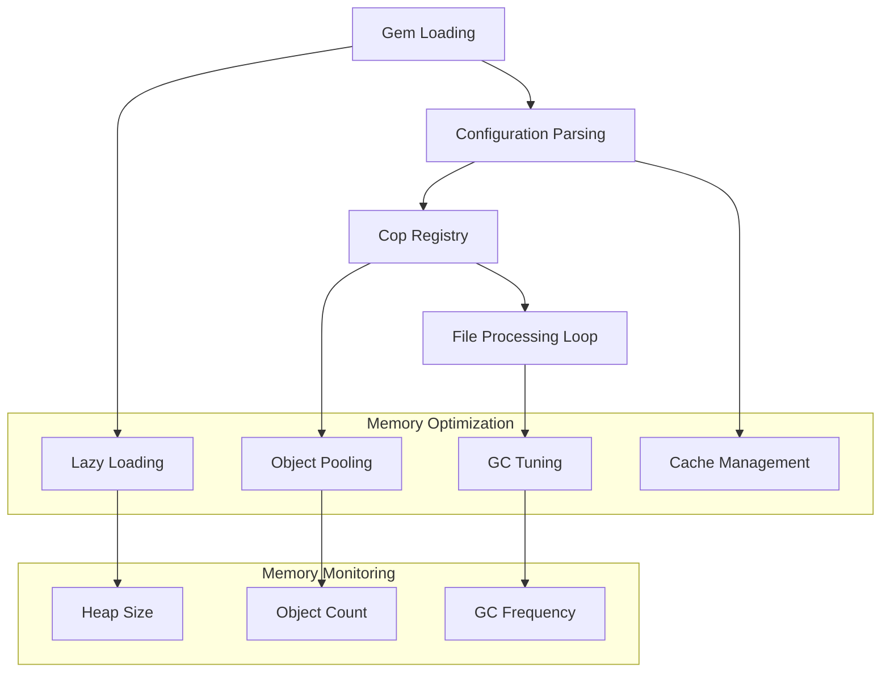

## 🔍 Monitoring & Observability

### Usage Analytics

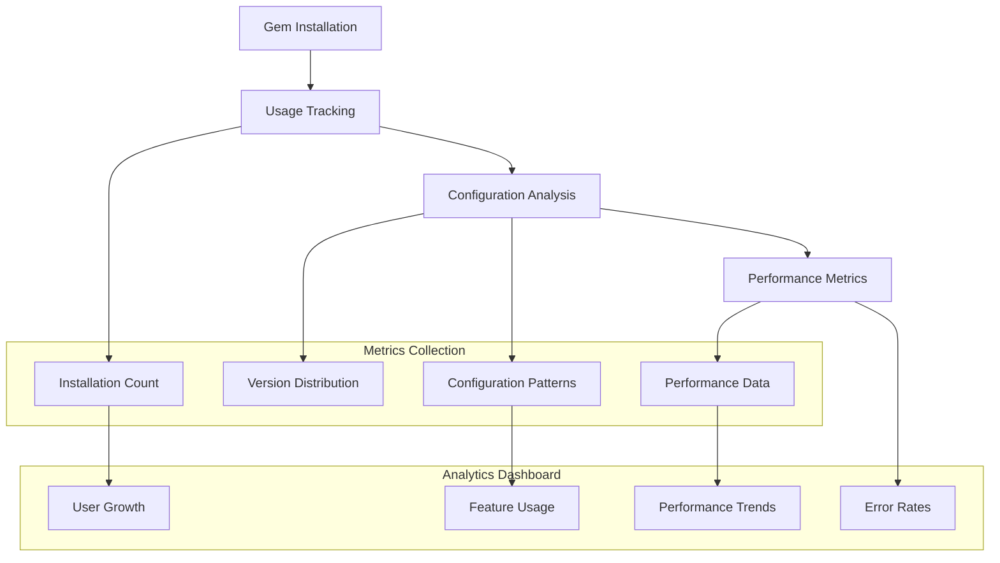

## 🛠️ Development Workflow

### Contributor Flow

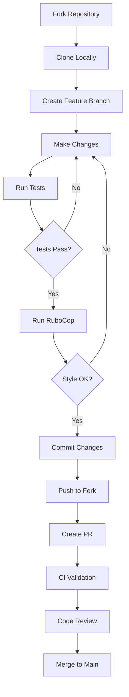

---

## 📚 Additional Resources

- [RuboCop Documentation](https://docs.rubocop.org/)
- [Ruby Style Guide](https://rubystyle.guide/)
- [Rails Style Guide](https://rails.rubystyle.guide/)
- [Contributing Guidelines](CONTRIBUTING.md)

---

<div align="center">

**Architecture designed with ❤️ for the Ruby community**

[📖 Back to README](README.md) • [🐛 Report Issue](https://github.com/hammadxcm/rubocop-hk/issues)

</div>