# 🏗️ RuboCop HK Architecture

> **Comprehensive architecture documentation for RuboCop HK configuration gem**  
> **🆕 v1.2.1: Warning-Only Modern Rules with Team-Focused Adoption Strategy**

## 📋 Table of Contents

- [🎯 Overview](#-overview)
- [🆕 v1.2.1 Architecture Changes](#-v120-architecture-changes)
- [🏛️ System Architecture](#️-system-architecture)
- [📦 Module Structure](#-module-structure)
- [⚙️ Configuration System](#️-configuration-system)
- [🔄 Plugin Integration](#-plugin-integration)
- [🧪 Testing Architecture](#-testing-architecture)
- [🚀 Deployment Flow](#-deployment-flow)
- [🔧 Extension Points](#-extension-points)
- [📊 Performance Considerations](#-performance-considerations)
- [🛠️ Team Adoption Architecture](#️-team-adoption-architecture)

## 🎯 Overview

RuboCop HK is a comprehensive configuration gem that provides curated RuboCop rules for modern Ruby and Rails applications. It follows a modular architecture that allows for flexible configuration inheritance and extensibility.

**🆕 v1.2.1 Enhancement**: Added 45+ warning-only modern rules with comprehensive team adoption tooling, educational documentation, and gradual migration strategies.

### Design Principles

- **🔧 Modular Configuration** - Separate configs for different concerns
- **📈 Gradual Adoption** - Easy migration path for existing projects
- **🎯 Rails-First** - Optimized for Rails development patterns
- **🔌 Extensible** - Plugin architecture for custom cops
- **⚡ Performance** - Minimal overhead and fast execution
- **⚠️ Warning-Only Modernization** - New rules as warnings to prevent build breaks
- **📚 Educational Approach** - Detailed explanations for every modern rule
- **🤝 Team-Focused** - Built-in tooling for team adoption workflows

## 🆕 v1.2.1 Architecture Changes

### Modern Rules Engine

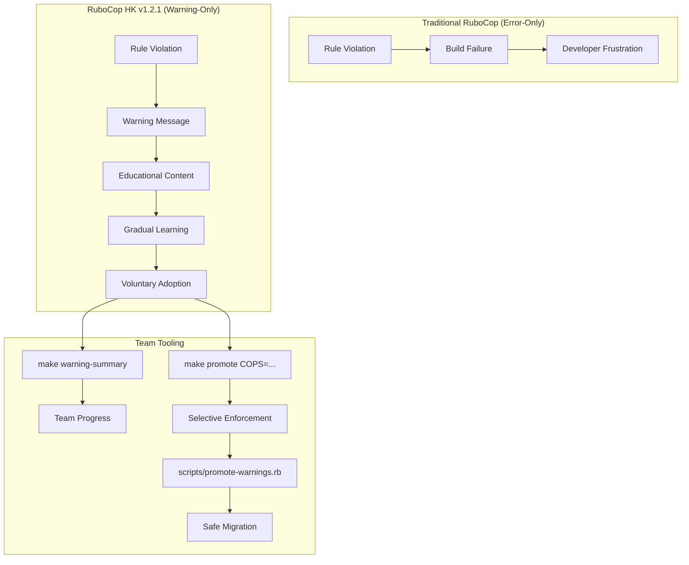

### Warning-Only Implementation Strategy

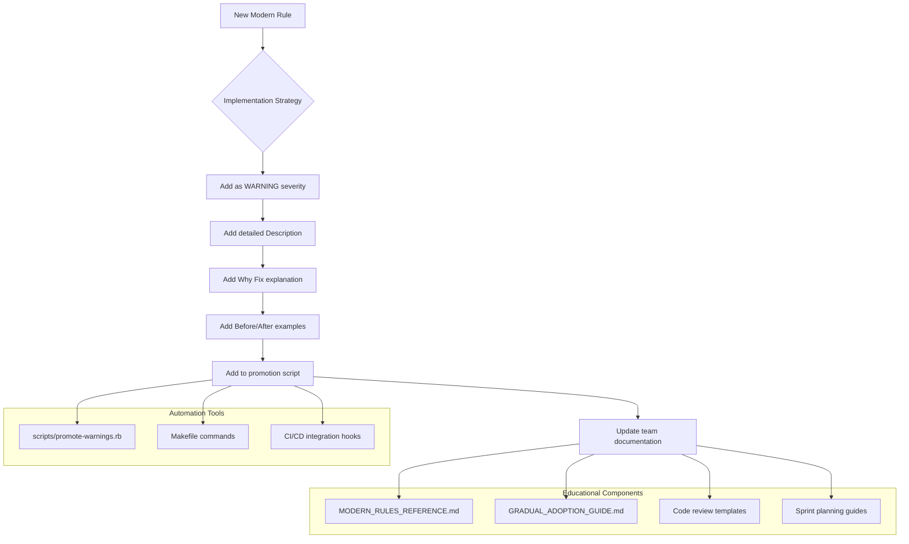

### Team Adoption Workflow

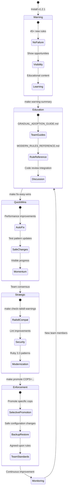

## 🏛️ System Architecture

### High-Level Architecture

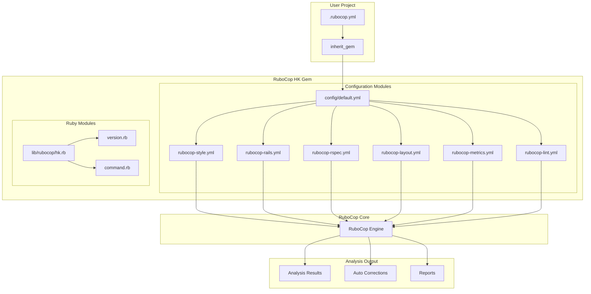

### Component Interaction Flow

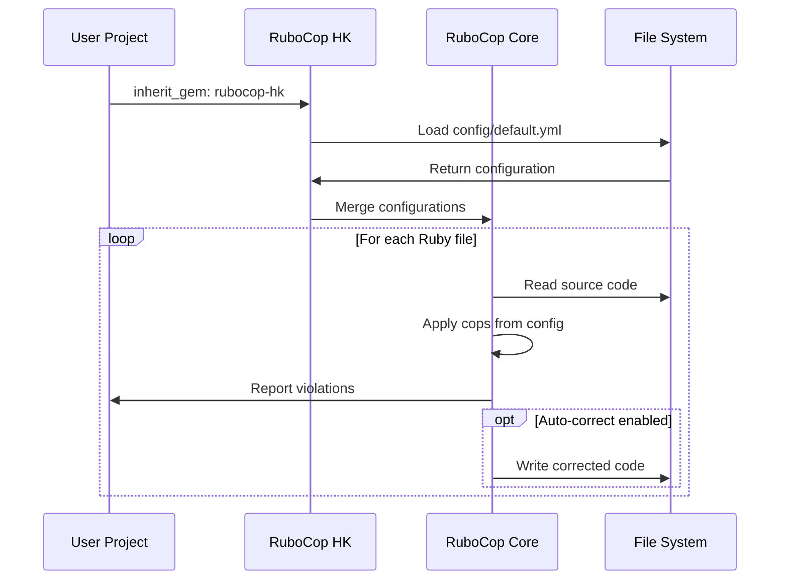

## 📦 Module Structure

### Directory Layout

```
lib/
├── rubocop/
│   └── hk/
│       ├── version.rb          # Gem version
│       ├── command.rb          # CLI commands
│       └── cops/              # Custom cops (future)
│           └── custom/
│               └── business_logic.rb
├── rubocop/
│   └── hk.rb                  # Main module
config/
├── default.yml               # Main configuration
├── rubocop-style.yml         # Style rules (🆕 10 warning-only modern rules)
├── rubocop-rails.yml         # Rails-specific rules (🆕 13 Rails 8.0 rules)
├── rubocop-rspec.yml         # RSpec rules (🆕 12 modern testing rules)
├── rubocop-layout.yml        # Code layout rules
├── rubocop-metrics.yml       # Complexity metrics
├── rubocop-performance.yml   # Performance rules (🆕 8 modern optimization rules)
└── rubocop-lint.yml          # Lint rules (🆕 10 security & quality rules)
scripts/                      # 🆕 Team adoption tooling
├── promote-warnings.rb       # Warning promotion automation
└── backup-restore.rb         # Configuration backup/restore
docs/                         # 🆕 Educational documentation
├── GRADUAL_ADOPTION_GUIDE.md # Team adoption strategy
├── MODERN_RULES_REFERENCE.md # Detailed rule explanations
└── CODE_REVIEW_TEMPLATES.md  # Review integration guides
Makefile                      # 🆕 15+ team workflow commands
```

### Module Dependencies

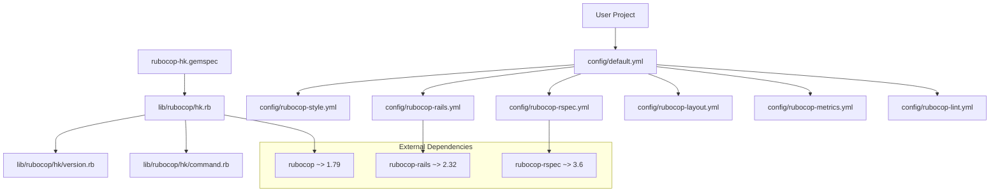

## ⚙️ Configuration System

### Configuration Inheritance

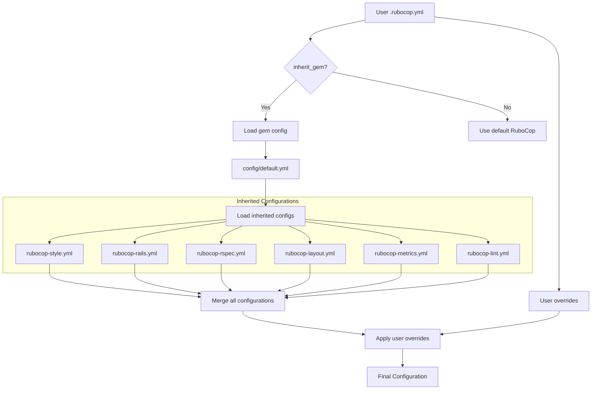

### Configuration Priority

1. **User .rubocop.yml** (Highest Priority)
2. **Gem default.yml** 
3. **Individual module configs**
4. **RuboCop defaults** (Lowest Priority)

### Dynamic Configuration

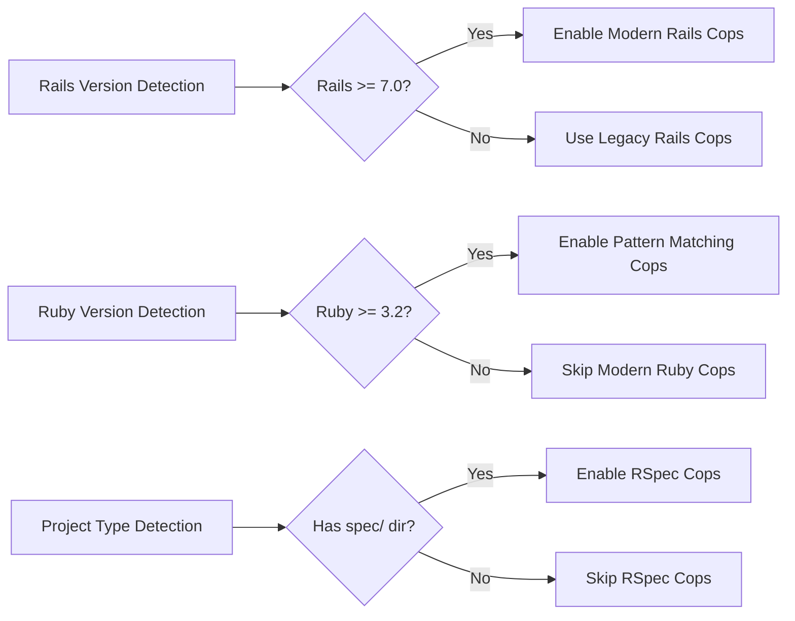

## 🔄 Plugin Integration

### RuboCop Plugin System

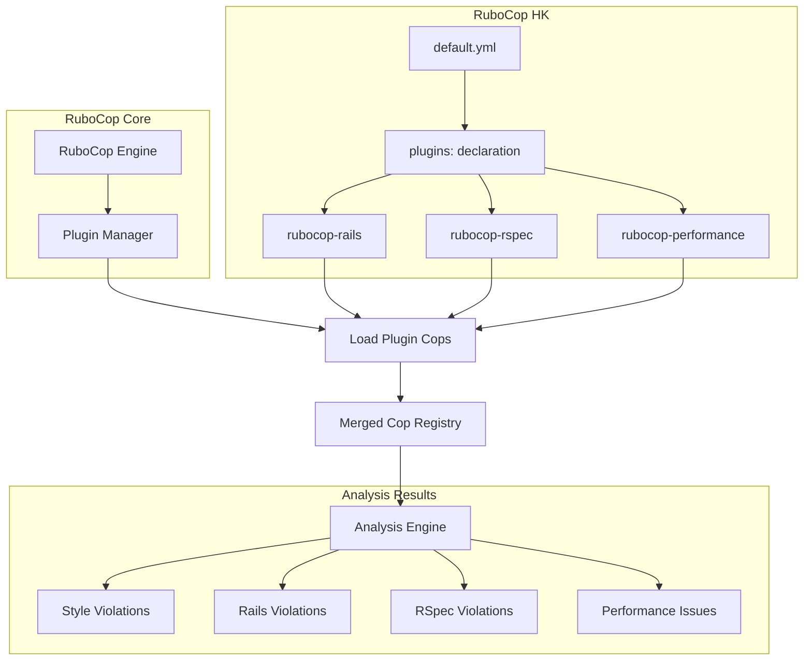

### Custom Cops Architecture

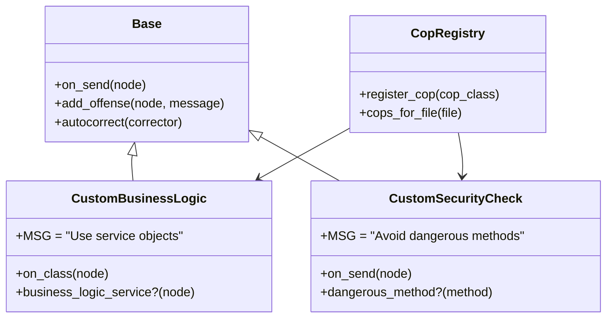

## 🧪 Testing Architecture

### Test Suite Structure

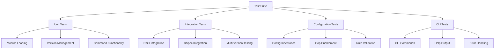

### Test Execution Flow

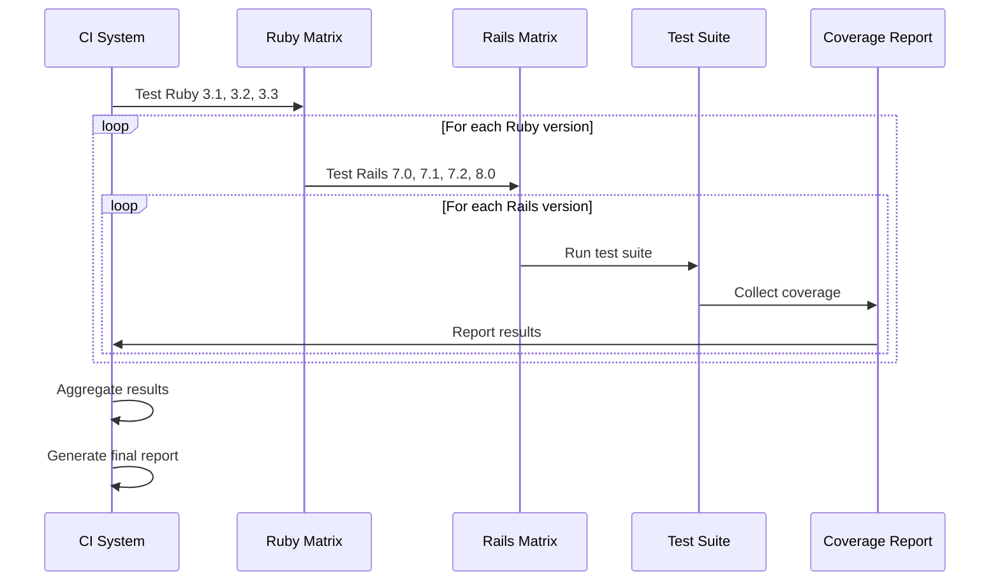

## 🚀 Deployment Flow

### Release Process

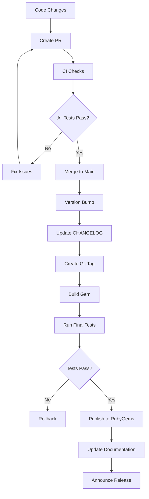

### Continuous Integration

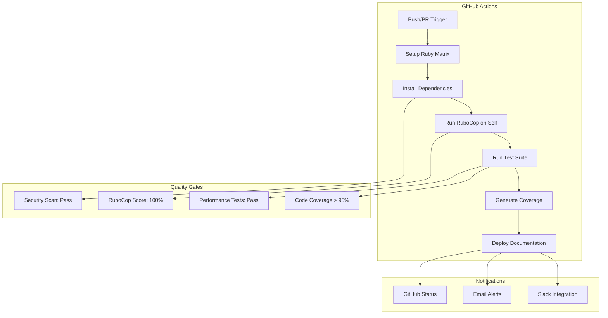

## 🔧 Extension Points

### Custom Cop Development

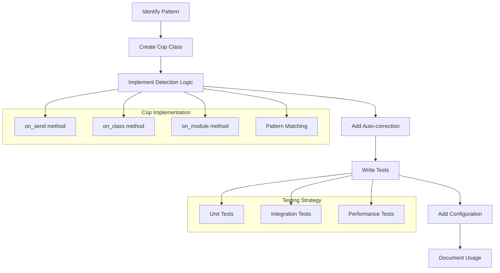

### Configuration Extension

```yaml
# Example custom configuration
inherit_gem:
  rubocop-hk: config/default.yml

# Custom cops namespace
CustomCops:
  BusinessLogic:
    Enabled: true
    Severity: warning
  
  SecurityCheck:
    Enabled: true
    Severity: error
    Exclude:
      - "lib/legacy/**/*"
```

## 📊 Performance Considerations

### Analysis Performance

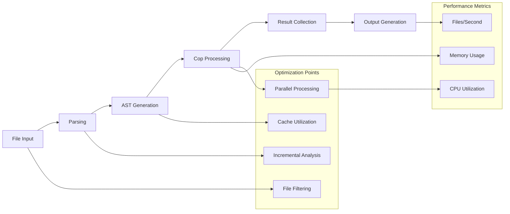

### Memory Management

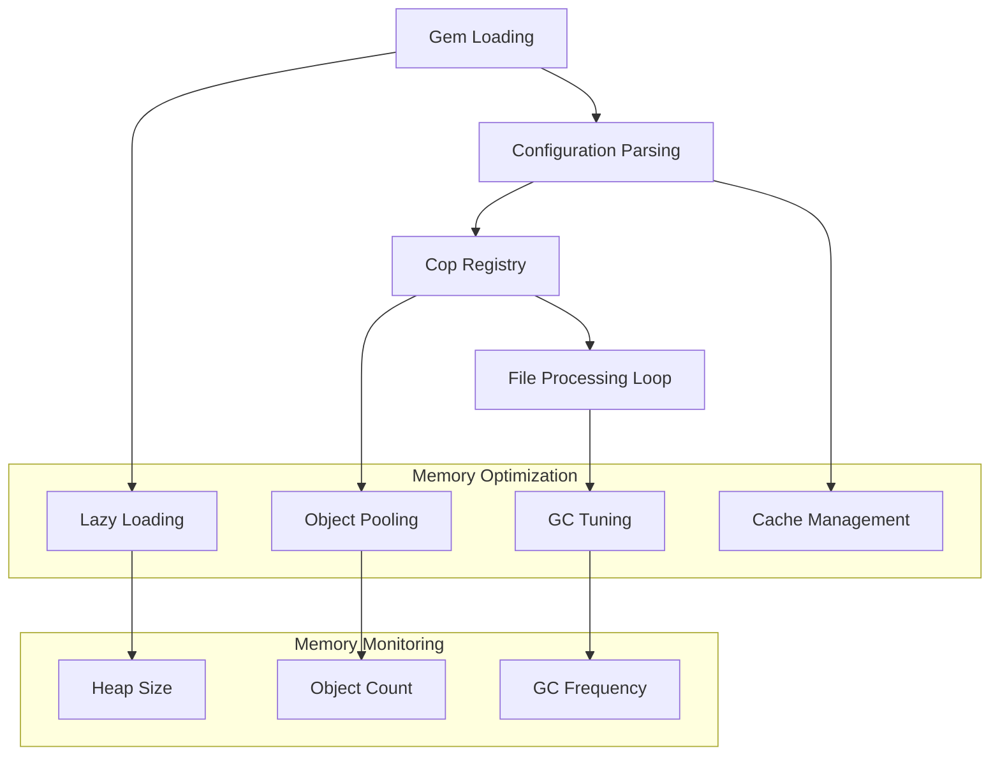

## 🔍 Monitoring & Observability

### Usage Analytics

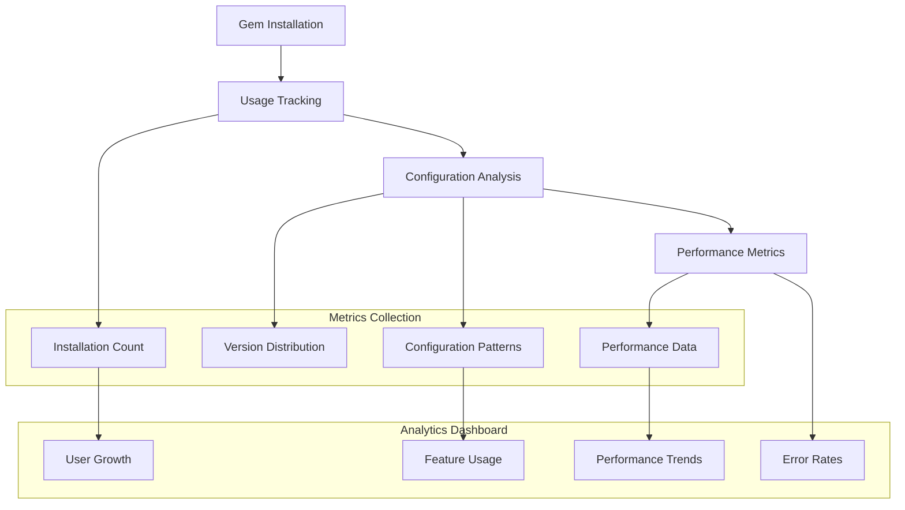

## 🛠️ Development Workflow

### Contributor Flow

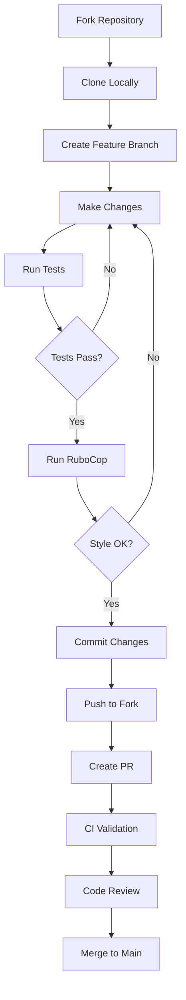

## 🛠️ Team Adoption Architecture

### Warning Promotion System

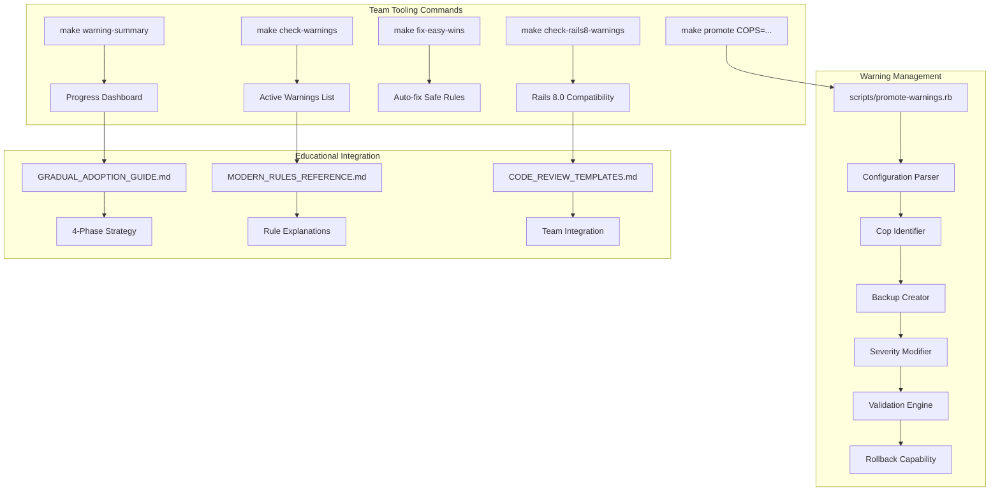

### 4-Phase Adoption Strategy Architecture

```mermaid
stateDiagram-v2
    state "Phase 1: Team Education" as P1 {
        [*] --> ReadGuides: GRADUAL_ADOPTION_GUIDE.md
        ReadGuides --> ReviewWarnings: make warning-summary
        ReviewWarnings --> TeamDiscussion: Weekly standup
        TeamDiscussion --> FocusNewCode: No pressure on legacy
    }
    
    state "Phase 2: Quick Wins" as P2 {
        [*] --> AutoFix: make fix-easy-wins
        AutoFix --> PerformanceWins: Performance/* cops
        PerformanceWins --> TestPatterns: RSpec/* improvements
        TestPatterns --> BuildMomentum: Visible progress
    }
    
    state "Phase 3: Strategic" as P3 {
        [*] --> Rails8Compat: make check-rails8-warnings
        Rails8Compat --> SecurityImprovements: Lint/* cops
        SecurityImprovements --> ModernPatterns: Style/* cops
        ModernPatterns --> TeamConsensus: Group decision making
    }
    
    state "Phase 4: Enforcement" as P4 {
        [*] --> SelectivePromotion: make promote COPS=...
        SelectivePromotion --> TeamStandards: Agreed rules → errors
        TeamStandards --> ContinuousImprovement: Monthly review
        ContinuousImprovement --> Celebration: Milestone achievements
    }
    
    [*] --> P1
    P1 --> P2: Week 2
    P2 --> P3: Month 1
    P3 --> P4: Month 2
    P4 --> [*]: Ongoing
```

### Educational Content Architecture

```mermaid
graph TD
    subgraph "Rule Documentation Structure"
        A[Individual Rule] --> B[Description]
        B --> C[Why Fix explanation]
        C --> D[Before/After examples] 
        D --> E[Priority guidance]
        E --> F[Team communication tips]
    end
    
    subgraph "Documentation Files"
        G[MODERN_RULES_REFERENCE.md] --> H[45+ Rule Details]
        I[GRADUAL_ADOPTION_GUIDE.md] --> J[Implementation Strategy]
        K[CODE_REVIEW_TEMPLATES.md] --> L[Review Integration]
    end
    
    subgraph "Team Integration Points"
        M[Sprint Planning] --> N[Prioritized Rule Lists]
        O[Code Reviews] --> P[Template Responses]
        Q[Team Standups] --> R[Progress Metrics]
        S[Retrospectives] --> T[Improvement Planning]
    end
    
    A --> G
    J --> M
    L --> O
    H --> Q
    J --> S
```

### Automation & CI Integration

```mermaid
flowchart TD
    subgraph "Local Development"
        A[Developer Commits] --> B[Pre-commit Hook]
        B --> C[make check-warnings]
        C --> D[Show Modernization Opportunities]
        D --> E[Educational Moment]
    end
    
    subgraph "CI Pipeline Integration"
        F[PR Created] --> G[CI Runs RuboCop]
        G --> H[Warnings Collected]
        H --> I[Educational Comments Added]
        I --> J[No Build Failure]
        J --> K[Review Process Enhanced]
    end
    
    subgraph "Team Dashboard"
        L[make warning-summary] --> M[Progress Metrics]
        M --> N[Team Performance]
        N --> O[Modernization Score]
        O --> P[Celebration Milestones]
    end
    
    subgraph "Safe Migration Tools"
        Q[make promote COPS=...] --> R[Configuration Backup]
        R --> S[Selective Rule Promotion]
        S --> T[Team Agreement Enforcement]
        T --> U[Rollback if Issues]
    end
    
    E --> F
    K --> L
    P --> Q
```

---

## 📚 Additional Resources

- [RuboCop Documentation](https://docs.rubocop.org/)
- [Ruby Style Guide](https://rubystyle.guide/)
- [Rails Style Guide](https://rails.rubystyle.guide/)
- [Contributing Guidelines](CONTRIBUTING.md)

---

<div align="center">

**Architecture designed with ❤️ for the Ruby community**

[📖 Back to README](README.md) • [🐛 Report Issue](https://github.com/hammadxcm/rubocop-hk/issues)

</div>