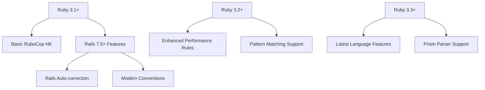
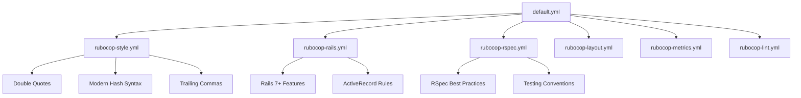
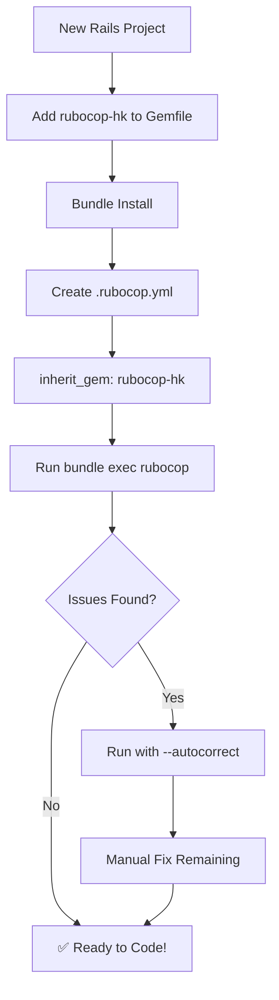
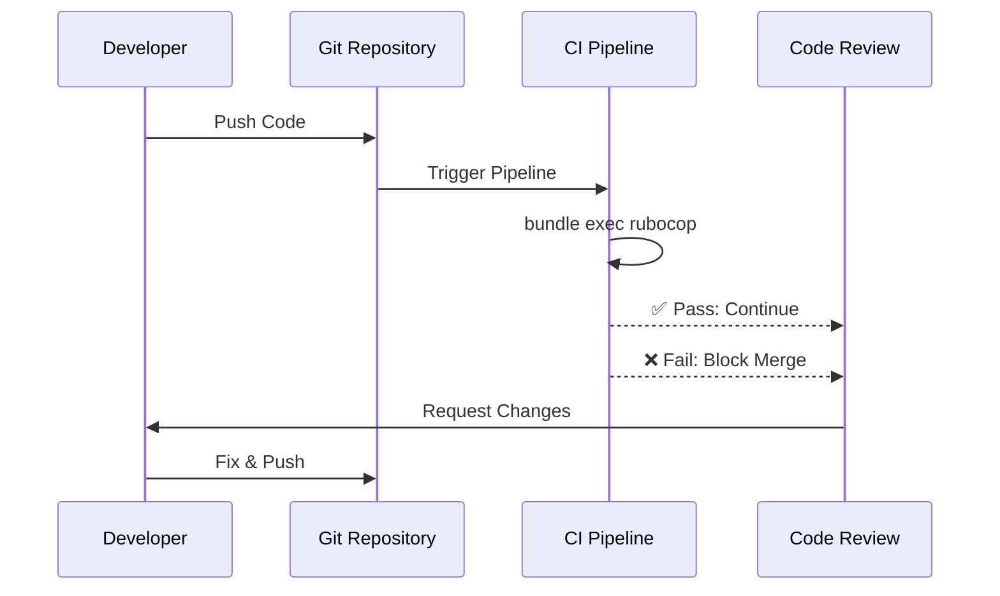

# 🔧 RuboCop HK

> **A comprehensive RuboCop configuration gem for modern Ruby and Rails applications**

[](https://badge.fury.io/rb/rubocop-hk)
[](https://www.ruby-lang.org)
[](https://rubyonrails.org)
[](https://opensource.org/licenses/MIT)
[](https://github.com/rubocop/rubocop)

## 📋 Table of Contents

- [🎯 Features](#-features)
- [📦 Installation](#-installation)
- [🚀 Quick Start](#-quick-start)
- [⚙️ Configuration](#️-configuration)
- [🔄 Rails Compatibility](#-rails-compatibility)
- [📊 Available Configurations](#-available-configurations)
- [🛠️ Advanced Usage](#️-advanced-usage)
- [🎨 Style Guide](#-style-guide)
- [📈 Development Workflow](#-development-workflow)
- [🤝 Contributing](#-contributing)
- [📝 License](#-license)

## 🎯 Features

✨ **Modern Ruby & Rails Standards**
- 🎯 **Rails 7.0-8.0+ Compatible** - Full support for latest Rails versions
- 💎 **Ruby 3.1+ Optimized** - Leverages modern Ruby features
- 📝 **Double Quote Convention** - Follows Rails 7+ string literal standards
- 🔧 **Comprehensive Rule Set** - 200+ carefully curated cops

✨ **Developer Experience**
- 🚀 **Zero Configuration** - Works out of the box
- 🎨 **Consistent Code Style** - Enforces modern Ruby/Rails patterns
- 📊 **Performance Optimized** - Includes performance and thread-safety rules
- 🧪 **Testing Integration** - RSpec-specific configurations included

✨ **Extensible & Flexible**
- 🔌 **Plugin Architecture** - Modern RuboCop 1.72+ plugin system
- 🎛️ **Selective Disabling** - Thoughtfully chosen cops can be disabled
- 📈 **Gradual Adoption** - Easy migration for legacy codebases
- 🔄 **Auto-correction** - Most rules support automatic fixing

## 📦 Installation

### Standard Installation

Add to your application's Gemfile:

```ruby
group :development, :test do
  gem "rubocop-hk", require: false
end
```

### With Version Constraint

```ruby
group :development, :test do
  gem "rubocop-hk", "~> 2.0", require: false
end
```

Then execute:

```bash
$ bundle install
```

Or install directly:

```bash
$ gem install rubocop-hk
```

## 🚀 Quick Start

### 1. Create Configuration File

Create `.rubocop.yml` in your project root:

```yaml
inherit_gem:
  rubocop-hk: config/default.yml
```

### 2. Run RuboCop

```bash
# Check your code
$ bundle exec rubocop

# Auto-fix issues
$ bundle exec rubocop --autocorrect

# Show progress
$ bundle exec rubocop --format progress
```

### 3. Rails Integration (Rails 7.2+)

For automatic formatting after Rails generators:

```ruby
# config/application.rb or config/environments/development.rb
config.generators.apply_rubocop_autocorrect_after_generate!
```

## ⚙️ Configuration

### Basic Setup

```yaml
# .rubocop.yml
inherit_gem:
  rubocop-hk: config/default.yml

AllCops:
  TargetRubyVersion: 3.1
  TargetRailsVersion: 7.0
```

### Custom Overrides

```yaml
# .rubocop.yml
inherit_gem:
  rubocop-hk: config/default.yml

# Override specific cops
Style/Documentation:
  Enabled: false

Metrics/ClassLength:
  Max: 150
```

### Environment-Specific Rules

```yaml
# .rubocop.yml
inherit_gem:
  rubocop-hk: config/default.yml

AllCops:
  Exclude:
    - "tmp/**/*"
    - "log/**/*"
    - "public/**/*"
```

## 🔄 Rails Compatibility

### Supported Versions

| Ruby Version | Rails Versions | Status | Recommendation |
|--------------|---------------|--------|----------------|
| **Ruby 3.3+** | Rails 7.1-8.0+ | ✅ **Recommended** | Latest features & performance |
| **Ruby 3.2** | Rails 7.0-8.0+ | ✅ **Supported** | Stable production choice |
| **Ruby 3.1** | Rails 7.0-7.2 | ✅ **Minimum** | End-of-life consideration |
| Ruby 2.7-3.0 | Rails 6.1-7.0 | ⚠️ **Legacy** | Upgrade recommended |

### Version-Specific Features



## 📊 Available Configurations

### Core Configurations

| Configuration | Description | Use Case |
|--------------|-------------|----------|
| `config/default.yml` | **Main configuration** | Standard Rails applications |
| `config/rubocop-rails.yml` | Rails-specific rules | Rails applications only |
| `config/rubocop-rspec.yml` | RSpec testing rules | Projects using RSpec |
| `config/rubocop-style.yml` | Style preferences | Code formatting |
| `config/rubocop-layout.yml` | Layout and spacing | Code structure |
| `config/rubocop-metrics.yml` | Complexity metrics | Code quality |
| `config/rubocop-lint.yml` | Error prevention | Bug detection |

### Configuration Tree



## 🛠️ Advanced Usage

### Custom Cop Development

```ruby
# lib/rubocop/cop/custom/business_logic.rb
module RuboCop
  module Cop
    module Custom
      class BusinessLogic < Base
        MSG = "Use business logic service objects"
        
        def on_class(node)
          # Custom cop implementation
        end
      end
    end
  end
end
```

### CI/CD Integration

#### GitHub Actions

```yaml
name: RuboCop
on: [push, pull_request]

jobs:
  rubocop:
    runs-on: ubuntu-latest
    steps:
      - uses: actions/checkout@v4
      - uses: ruby/setup-ruby@v1
        with:
          ruby-version: 3.3
          bundler-cache: true
      - run: bundle exec rubocop --format github
```

#### GitLab CI

```yaml
rubocop:
  image: ruby:3.3
  stage: test
  script:
    - bundle install
    - bundle exec rubocop --format junit --out rubocop-results.xml
  artifacts:
    reports:
      junit: rubocop-results.xml
```

### VS Code Integration

```json
{
  "ruby.rubocop.executePath": "bundle exec",
  "ruby.rubocop.configFilePath": ".rubocop.yml",
  "[ruby]": {
    "editor.formatOnSave": true,
    "editor.defaultFormatter": "misogi.ruby-rubocop"
  }
}
```

## 🎨 Style Guide

### String Literals

✅ **Preferred (Double Quotes)**
```ruby
# Good
message = "Hello, world!"
interpolation = "User: #{user.name}"
escaped = "Line 1\nLine 2"
```

❌ **Avoid (Single Quotes)**
```ruby
# Avoid
message = 'Hello, world!'
interpolation = 'User: ' + user.name
```

### Method Definitions

✅ **Preferred**
```ruby
# Good - with parentheses
def calculate_total(items)
  items.sum(&:price)
end

def user_count()
  User.count
end
```

### Trailing Commas

✅ **Preferred**
```ruby
# Good - consistent trailing commas
user_attributes = {
  name: "John",
  email: "john@example.com",
  role: "admin", # <- trailing comma
}

tags = [
  "ruby",
  "rails",
  "programming", # <- trailing comma
]
```

## 📈 Development Workflow

### Setup Flow



### CI Integration Flow



## 📋 Migration Guide

### From Other RuboCop Configs

```yaml
# Before (other config)
inherit_gem:
  other-rubocop-config: config/base.yml

# After (rubocop-hk)
inherit_gem:
  rubocop-hk: config/default.yml
```

### Legacy Project Migration

1. **Start Gradual**: Enable rules incrementally
2. **Use TODO**: Generate `.rubocop_todo.yml`
3. **Team Training**: Ensure team understands new conventions

```bash
# Generate TODO file for gradual migration
$ bundle exec rubocop --auto-gen-config
```

## 🤝 Contributing

We welcome contributions! Please see our [Contributing Guide](CONTRIBUTING.md) for details.

### Development Setup

```bash
# Clone the repository
$ git clone https://github.com/yourusername/rubocop-hk.git
$ cd rubocop-hk

# Install dependencies
$ bundle install

# Run tests
$ bundle exec rspec

# Run RuboCop on itself
$ bundle exec rubocop
```

### Reporting Issues

Please use our [issue tracker](https://github.com/yourusername/rubocop-hk/issues) to:
- 🐛 Report bugs
- 💡 Suggest enhancements
- 📖 Improve documentation
- ❓ Ask questions

## 🏗️ Architecture

For detailed architecture information, see [ARCHITECTURE.md](ARCHITECTURE.md).

## 📝 License

This gem is available as open source under the terms of the [MIT License](https://opensource.org/licenses/MIT).

## 🙏 Acknowledgments

- [RuboCop](https://github.com/rubocop/rubocop) - The Ruby static code analyzer
- [Ruby on Rails](https://rubyonrails.org/) - The web framework
- Ruby Community - For coding standards and conventions

---

<div align="center">

**Made with ❤️ by [Hammad Khan](https://github.com/yourusername)**

[🐛 Report Bug](https://github.com/yourusername/rubocop-hk/issues) • 
[✨ Request Feature](https://github.com/yourusername/rubocop-hk/issues) • 
[📖 Documentation](https://github.com/yourusername/rubocop-hk/wiki)

</div>